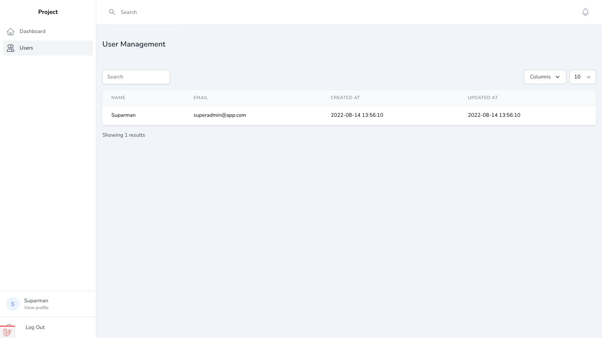

[](https://github.com/nasrulhazim/project-template/actions/workflows/lint.yml) [](https://github.com/nasrulhazim/project-template/actions/workflows/test.yml)

# Project Template

This is my personal project template / boilerplate for creating Laravel based projects.



## Development

Some of the features has been added to this project. See the following sections for more details.

### Livewire

Using Alert component:

```php
$this->emitTo('alert', 'displayAlert',  __('Connection'), __('Connection succesfully deleted'));
```

Using Confirm component:

```php
<div class="cursor-pointer" class="bg-red-500" 
    wire:click="$emitTo('confirm', 'displayConfirmation', 'Delete Connection', 'Are you sure?', 'connection-form', 'destroyConnection', '{{ $uuid }}')">
    {{ __('Remove') }}
</div>
```

Both of the Alert & Confirm modal are using the Laravel Jetstream modal.

Using Datatable Actions:

```php
public function columns(): array
{
    return [
        Column::make('Name', 'name')
            ->sortable(),
        Column::make('Actions', 'uuid')
            ->format(
                fn ($value, $row, Column $column) => view('livewire.datatable-actions', ['form' => 'resource-form', 'value' => $value, 'row' => $row, 'column' => $column])
            ),
    ];
}
```

To create a form to edit / update, you need to create Livewire component first:

```bash
php artisan make:livewire Device
```

Then use the `InteractsWithLivewireForm` trait. All the properties defined below are required.

```php
<?php

namespace App\Http\Livewire;

use App\Actions\Sensor\CreateNewDevice;
use App\Concerns\InteractsWithLivewireForm;
use App\Models\Device;
use Livewire\Component;

class DeviceForm extends Component
{
    use InteractsWithLivewireForm;

    public string $model = Device::class;
    public string $action = CreateNewDevice::class;
    public string $formTitle = 'Device';
    public string $view = 'livewire.device-form';
    protected $listeners = [
        'showRecord' => 'show',
        'destroyRecord' => 'destroy',
    ];
    public $state = [
        'name' => '',
    ];
}
```

## Deployment

Deploy the `./bin/deploy` to your server, then you need to add the deployment key, as following.

You may want to trigger the script manually or by webhook (require additional setup which not cover in this repo).

This script will deploy based on **latest tagged**. It won't deploy to any non-tagged. Run the follow command as root user.

### Creating Deployment Key

TLDR, create deployment keys:

```bash
$ ssh-keygen -t ed25519 -C "your@email.com"
> Enter a file in which to save the key (/Users/you/.ssh/id_algorithm):
> Enter passphrase (empty for no passphrase): [Type a passphrase]
> Enter same passphrase again: [Type passphrase again]
$ eval "$(ssh-agent -s)"
$ ssh-add -k /Users/you/.ssh/id_algorithm
$ cat /Users/you/.ssh/id_algorithm.pub
```

Copy the output then add key in [Deploy Keys](https://github.com/nasrulhazim/um-ehr-services/settings/keys)

References:

1. <https://docs.github.com/en/authentication/connecting-to-github-with-ssh/generating-a-new-ssh-key-and-adding-it-to-the-ssh-agent>
2. <https://docs.github.com/en/authentication/connecting-to-github-with-ssh/adding-a-new-ssh-key-to-your-github-account>

### Running the Script

Deploy it anywhere in your server, then run:

```bash
sudo su
. ./deploy
```
